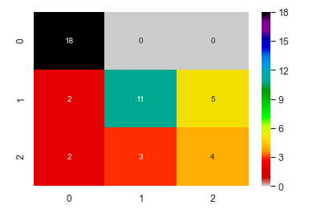
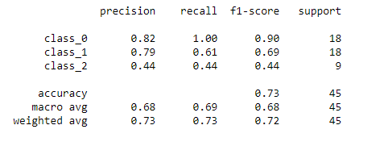

# Wine-Classification
### Code File: Wine-Classification.ipynb
The project performs both unsupervised and supervised machine learning using Scikit-learn module to classify among different wines. 

### Unsupervised Learning using Kmeans clustering and Dimensionality Reduction
For the unsupervised part, it ignores the actual values and predicts the values using k-means clustering. 
Due to multiple factors, the dimensionality have been reduced down to two dimensions using the t-distributed stochastic neighbor embedding (TSNE) and the Principal Component Analysis (PCA) estimators.

### Supervised Learning using Kneighbors-classifier 
For the supervised part, K-Neighbors-Classifier is used to predict the wine based on the actual values in the dataset. 

At last, **confusion matrix** and **classification reports** have been created to give further insights.

### Confusion Matrix
 

### Classification Report

